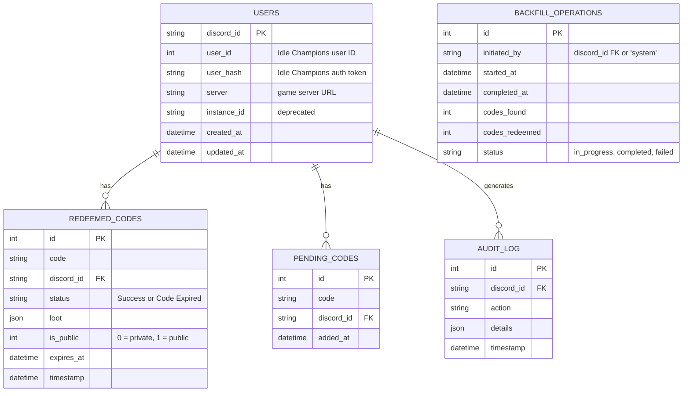

# Development Guide

## Quick Start

**⚠️ IMPORTANT: Always use Mise. Never use npm or bun run directly.**

```bash
# Install dependencies
mise run install

# Start development server with auto-rebuild
mise run dev

# View all available tasks
mise tasks
```

### If You Don't Have Mise Installed

```bash
# Install Mise (macOS/Linux)
curl https://mise.jdx.dev/install.sh | sh

# Or with Homebrew
brew install mise

# Then follow "Quick Start" above
```

## Project Structure

```
src/bot/
├── bot.ts                      # Main Discord client & events
├── api/
│   └── idleChampionsApi.ts     # Game API client (query-param based)
├── commands/
│   ├── setup.ts                # Save user credentials
│   ├── redeem.ts               # Manual code redemption
│   ├── inventory.ts            # Show account info
│   ├── open.ts                 # Open chests
│   ├── blacksmith.ts           # Upgrade heroes
│   ├── codes.ts                # Show code history
│   ├── makepublic.ts           # Share codes with other users
│   ├── backfill.ts             # Recover missed codes from history
│   └── help.ts                 # Command help
├── database/
│   ├── db.ts                   # Drizzle database connection & migrate()
│   ├── userManager.ts          # User credentials storage
│   ├── codeManager.ts          # Code tracking & history
│   ├── auditManager.ts         # Audit log operations
│   ├── backfillManager.ts      # Backfill operations & locking
│   ├── schema/                 # Drizzle table definitions (one file per table)
│   │   ├── index.ts
│   │   ├── users.ts
│   │   ├── redeemed_codes.ts
│   │   ├── pending_codes.ts
│   │   ├── audit_log.ts
│   │   └── backfill_operations.ts
│   └── migrations/             # Auto-generated SQL migrations (drizzle-kit)
├── handlers/
│   ├── codeScanner.ts          # Message code detection
│   └── backfillHandler.ts      # Message history scanning & redemption
└── utils/
    └── debugLogger.ts          # Response logging & cleanup

lib/
└── *.d.ts                      # Type definitions from game API
```

## Key Technologies

- **Mise** - Task runner and tool version manager (MANDATORY)
- **Bun 1.3.13** - JavaScript runtime (3-4x faster than Node.js; also used as package manager)
- **discord.js 14.26** - Discord bot framework
- **bun:sqlite** - Built-in SQLite module (replaces `sqlite3`)
- **Drizzle ORM** - Type-safe query builder and schema manager
- **Bun Fetch API** - Built-in HTTP client (replaces `node-fetch`)
- **TypeScript** - Type-safe development (`noEmit: true`; type-check only)

## Important Notes

### SSL Certificate Issue

The Idle Champions API server has an expired SSL certificate. Always start the bot with:

```bash
NODE_TLS_REJECT_UNAUTHORIZED=0
```

### Instance ID Problem

When calling game APIs (redeem, open chests, blacksmith), you must:

1. Fetch fresh user details via `getUserDetails()`
2. Extract `instance_id` from `details.instance_id`
3. Pass it to the API call

This prevents "Outdated instance id" errors from the server.

### API Pattern

All game API calls use URL query parameters, not JSON body:

```
POST /~idledragons/post.php?call=redeemcoupon&user_id=X&hash=Y&instance_id=Z&code=ABC
```

## Building

The production build compiles TypeScript into a self-contained native binary:

```bash
# Build production binary (bun build --compile)
mise run prod:build

# Type-check only (no output files)
mise run build

# Run the binary
./dist-bundle/bot
```

For development, Bun runs TypeScript directly — no compile step is needed.

## Common Tasks

All tasks are run through Mise. Use `mise tasks` to see all available commands:

```bash
mise run install      # Install dependencies
mise run dev          # Start bot directly from TypeScript source
mise run build        # Type-check only (noEmit: true)
mise run prod:build   # Build self-contained production binary
mise run lint         # Check code quality
mise run lint:fix     # Auto-fix linting issues
mise run audit        # Check for vulnerabilities
mise run clean        # Clean build artifacts
```

## Database

SQLite database (`./data/idle.db`) managed with Drizzle ORM. Schema is defined in TypeScript files under `src/bot/database/schema/`. Migrations are automatically applied at startup via `migrate()`.

To regenerate migrations after schema changes:

```bash
bun run db:generate   # Regenerate SQL migrations from schema
bun run db:studio     # Open Drizzle Studio (visual DB browser)
```



## Testing Commands

```
/setup user_id:123456 user_hash:abc123def456...

/redeem code:TESTCODE

/inventory

/open chest_type:Gold count:5

/blacksmith contract_type:Small hero_id:1 count:3

/help
```

## Debugging

The bot saves API responses to `debug/` folder automatically:

- Files older than 1 hour are deleted
- Useful for troubleshooting API issues
- Format: `endpoint_YYYY-MM-DDTHH-mm-ss-SSSZ.json`

## Environment Variables

```bash
DISCORD_TOKEN      # Bot token from Discord Developer Portal
DISCORD_GUILD_ID   # Server ID (for guild-specific commands)
DISCORD_CHANNEL_ID # Channel ID (for auto code scanning)
DISCORD_CODE_AUTHOR_ID # User/bot ID that posts promo codes (filters backfill to that author only)
DB_PATH            # Database file path (default: ./data/idle.db)
NODE_ENV           # development or production
```
